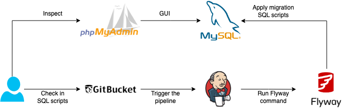

# Goal and Architecture
The goal for this poc project is about how to better track DDL (Data Definition Language) database changes. The following are the open source tools that are used.
* Git platform and DevOps
    * Gitbucket (alternative for Github, Bitbucket, etc)
    * Jenkins (alternative for Gitlab, Azure DevOps, etc)
* Database
    * MySQL 
    * phpMyAdmin 
* Database migration tools
    * Flyway (alternative for Liquibase, alembic, sqitch, etc)

The architecture diagram and everything uses Docker containers.
<p align="center">

</p>

# Services Setup
1. Create a network called `mynetwork` to connect all the services.
    ```sh
    docker network create mynetwork
    ```

2. Run the `mysql` and `phpmyadmin` containers.
    ```sh
    cd ./jenkins_mysql_flyway
    docker compose -f docker-compose-db.yml -p db up -d
    ```
    * Log in `phpmyadmin`.
        * `http://localhost:8081`
        * username:password is `root:root` or `admin:admin`

3. Run the `gitbucket` and `jenkins` containers.
    ```sh
    docker compose -f docker-compose-jenkins.yml -p devops up -d
    ```
    * Log in `gitbucket`.
        * `http://localhost:8082`
        * username:password is `root:root`
    * Start `jenkins`.
        * `http://localhost:8080`
        * Create an admin user with username:password as `admin:admin`.
        * Install the [Gitbucket](https://plugins.jenkins.io/gitbucket/) plugin.

4. Create a repo called `flyway_repo`, in the `gitbucket` container through the ui and check in all the files in `~/DevOps_In_DE/jenkins_mysql_flyway/flyway_repo` to the repo.
    * Run the commands with `root:root` as username:password.
        ```sh
        cd ./jenkins_mysql_flyway/flyway_repo
        git init
        git add .
        git commit -m "first commit"
        git remote add origin http://localhost:8082/git/root/flyway_repo.git
        git push -u origin main
        ```
    * ==short video (TBD)==

5. Create a pipeline called `flyway_pipeline` in the `jenkins` container through the ui and have it connect to the repo, `flyway_repo`.
    * The repo URL is `http://gitbucket:8080/git/root/flyway_repo.git`.
    * ==short video (TBD)==

# Trigger (have services connected together)
1. Move all the `*.sql` files in `~/DevOps_In_DE/jenkins_mysql_flyway/flyway_repo/sql_to_deploy` to `~/DevOps_In_DE/jenkins_mysql_flyway/flyway_repo/sql`.
    ```sh
    mv ./sql_to_deploy/* ./sql
    ```

2. Check in the changes to the repo.
    ```sh
    git add .
    git commit -m 'run versioned sql query'
    git push
    ```

3. Run `flyway` using the Jenkins pipline, `flyway_pipeline`.
    * Manually trigger the pipeline by hitting the `Build Now`.
    * Check out the database called `db-name` through `phpmyadmin` ui to see if the changes are applied.
    * ==short video (TBD)==

* If debugging is needed, try run `flyway` in local using docker commands.
    ```sh
    export PROJECT_FULLPATH=. && docker compose up && docker compose down
    ```

# Clean up
* Remove all the containers.
    ```sh
    cd ./jenkins_mysql_flyway
    docker compose -f docker-compose-db.yml -p db down
    docker compose -f docker-compose-jenkins.yml -p devops down

    docker network prune -f
    docker volume prune -f
    ```
* Remove the local git repo (`flyway_repo`).
    ```sh
    cd ./jenkins_mysql_flyway/flyway_repo
    rm -rf .git
    ```
# Future works
* Figure out how to automatically run the pipeline in `jenkins` by checking in the code to the repo in `gitbucket` instead of manually hitting `Build Now` on the ui.
    * For some reasons, the webhook to connect `jenkins` and `gitbucket` was not working as expected this time.  
        * [How to trigger auto build in Jenkins via Gitbucket's webhook?](https://stackoverflow.com/questions/49574298/how-to-trigger-auto-build-in-jenkins-via-gitbuckets-webhook)
        * [How to auto build a job in jenkins if there is any change in code on Github repository](https://www.edureka.co/community/49753/auto-build-job-jenkins-there-change-code-github-repository)
* Think about how to handle the DML (Data Manipulation Language) changes.

# References
* [Fear database changes? Get them under control with CI/CD](https://hackernoon.com/database-changes-can-be-scary-how-r1hy2gfe)
* [DevOps tech: Database change management](https://cloud.google.com/architecture/devops/devops-tech-database-change-management)
* [Jenkins in Docker: Running Docker in a Jenkins Container](https://hackmamba.io/blog/2022/04/running-docker-in-a-jenkins-container/)
* [Running PostgreSQL and Flyway with Docker Compose](https://writeitdifferently.com/postgresql/flyway/2020/03/15/running-postgresql-and-flyway-with-docker-compose.html)
* [Database version control: Getting started with Flyway](https://www.red-gate.com/simple-talk/devops/database-devops/database-version-control-getting-started-with-flyway/)
